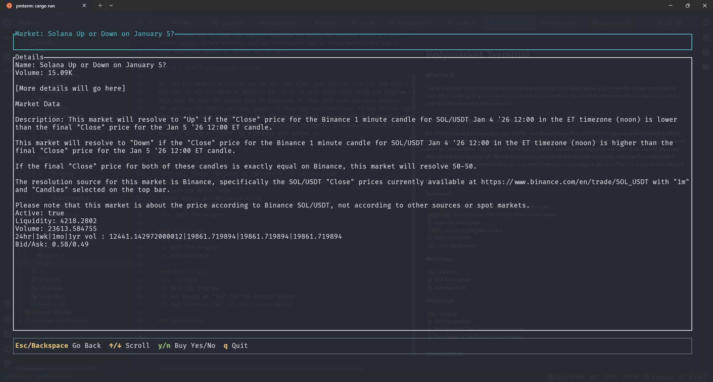
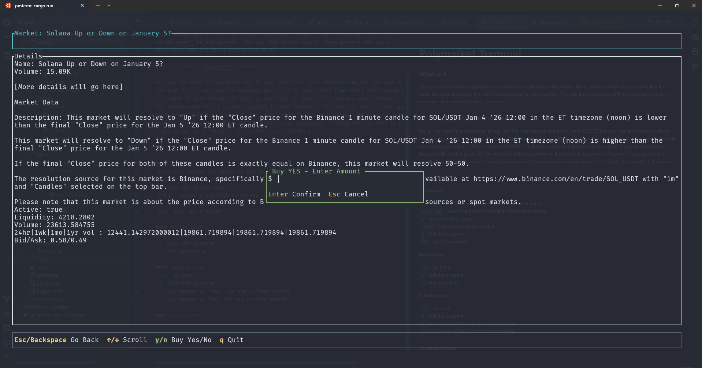
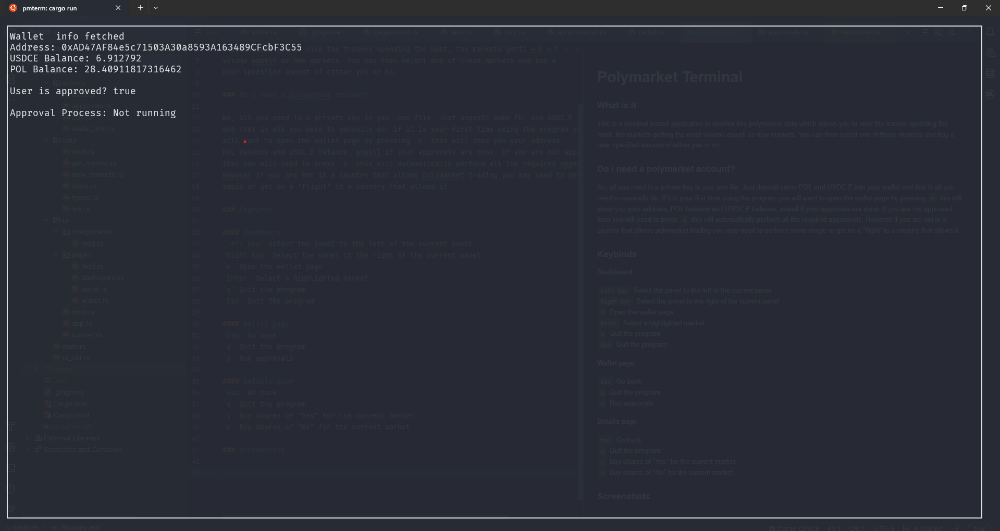

# Polymarket Terminal

### What is it

This is a terminal based application to monitor live polymarket data
which allows you to view the traders spending the most, the markets getting the most 
volume aswell as new markets. You can then select one of these markets and buy a 
user specified amount of either yes or no. 

## Do i need a polymarket account?

No, all you need is a private key in you .env file. Just deposit some POL and USDC.E into your wallet
and that is all you need to manually do. If it is your first time using the program you
will want to open the wallet page by pressing `w` this will show you your address, 
POL balance and USDC.E balance, aswell if your approvals are done. If you are not approved
then you will need to press `a` this will automatically perform all the required apporovals.
However if you are not in a country that allows polymarket trading you may need to perform some
magic or get on a "flight" to a country that allows it. 

## Keybinds

#### Dashboard
`Left Key` Select the panel to the left of the current panel  
`Right Key` Select the panel to the right of the current panel  
`w` Open the wallet page  
`Enter` Select a highlighted market  
`q` Quit the program  
`Esc` Quit the program

#### Wallet page
`Esc` Go back  
`q` Quit the program  
`a` Run approvals

#### Details page
`Esc` Go back  
`q` Quit the program  
`y` Buy shares of "Yes" for the current market  
`n` Buy shares of "No" for the current market

## Screenshots

### Dashboard

### Market

### Buy

### Wallet

## Todo

- Selling
- Convert general info to portfolio
- Orderbook for currently selected market
